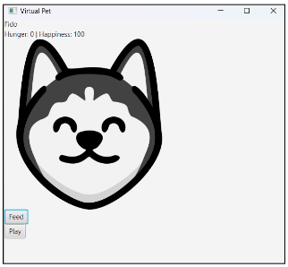
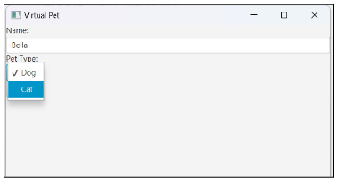
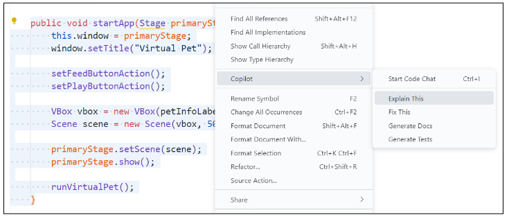

# Virtual Pet App

The app currently defaults to a dog and does not allow users to choose their pet. The user also does not allow the user to choose a name for their pet.

But what we want is to let the user choose the type of pet they want and give it a name before they can feed and play with their pet.

## Step 1: Understanding the Code

Before we start modifying this code, we should first make sure we understand what it currently does. Take a moment to read through the code. For any parts that you're unsure of, highlight the code and right-click, then choose **Copilot > Explain This**.

Copilot will generate an explanation of the code you highlighted in the chat panel. Be sure also to ask follow-up questions if you need additional clarification on the code.

## Step 2: Breaking Down the Problem

AI code-generators like Copilot are most effective when the task you want them to do is clear and specific. Before asking Copilot what code you need to solve this problem, outline the steps the program needs to take to implement the desired functionality.

Remember, the user wants to choose either a cat or a dog and give it a name. There is an empty `PetSelectionScene` class, and there is code commented out in `App.java` to create a `PetSelectionScene` object and start the app from this scene instead of the `PetApp` scene.

✅ **Do This:** With your partner, plan the steps the app needs to take. This can be in the form of pseudocode, a flowchart, sketches, or any other representation you choose.

Write your plan here!

## Step 3: Planning the Prompt

✅ Do This: Based on the steps you've outlined, what code do we need to ask Copilot for? With your partner, plan the prompt you want to ask Copilot.

Write your prompt here!

> &nbsp;
> **Tip!**
>
> Try starting your prompt with `"Modify PetSelectionScene.java to"` followed by the steps that need to be added to this method.
> &nbsp;

## Step 4: Evaluating the Code

AI code-generating tools like Copilot are not always right and sometimes even suggest code that is redundant or inefficient. Before adding its suggestion to the program, let's check if it makes sense and aligns with what we're expecting.

✅ **Do This:** With your partner, trace the code Copilot suggested as a solution. This can be in the form of a numbered or bulleted list, a flowchart, a drawing, or any other representation you choose.

Trace your code here!

Based on your analysis, would the code it suggested make sense as a solution to the problem? Why or why not?

Write your response here!

If the code it suggested does **not** make sense as a solution, what needs to be improved - the steps you outlined to solve the problem or the prompt you gave Copilot? What modifications do you need to make?

Write your response here!

**🔁 Repeat this process until you feel confident you have a working solution!**

## Step 5: Testing the Code

So the code it gave makes sense . . . now what?? Well, let's add it to our program and see if it works!

✅ **Do This:** Update the `PetSelectionScene` class with the code that needs to be added to implement the desired functionality.

Run the app (`App.java`)! Test choosing a dog and giving it a name, then test choosing a cat and giving it a name. Did it work? Why or why not?

Write your response here!

If the app does **not** work as expected, what is it doing or **not** doing?

Write your response here!

**🔁 If the app doesn't work as expected, follow the process you used in Steps 2 through 5 to break down the problem, plan the prompt to ask Copilot, evaluate the code it suggests, and implement and test its suggestion.**
